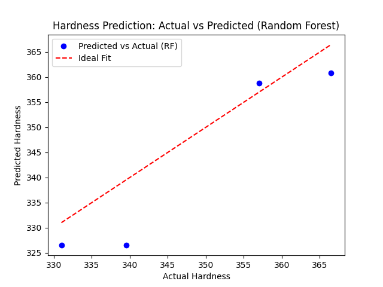
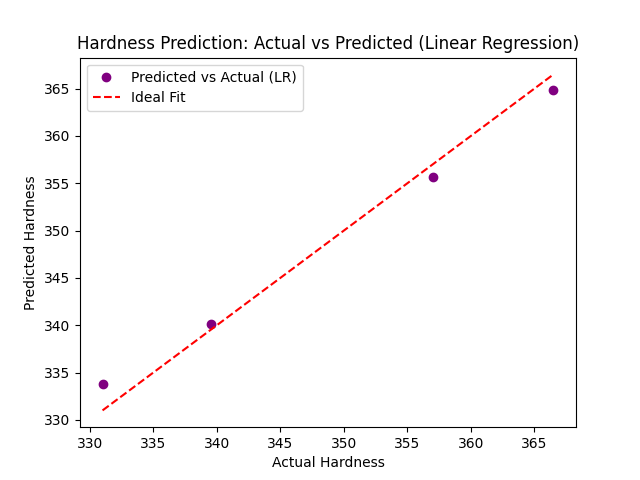
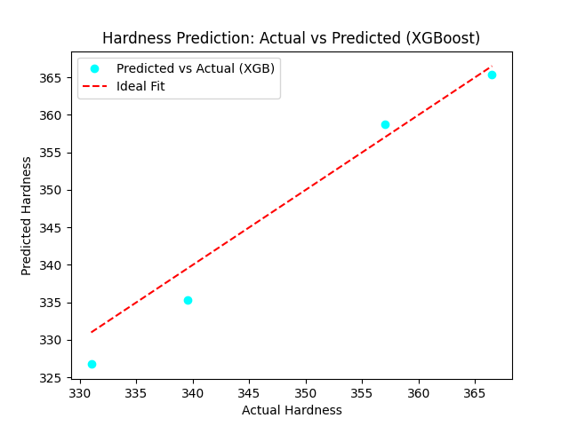
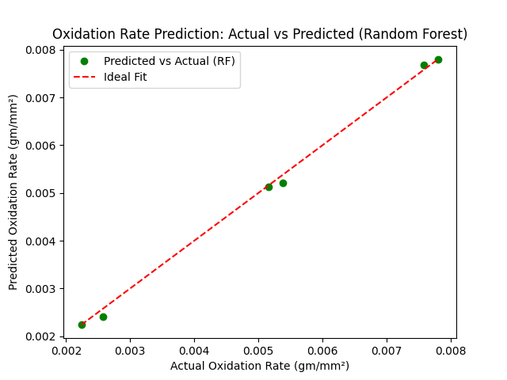
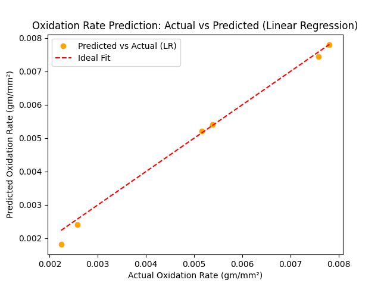
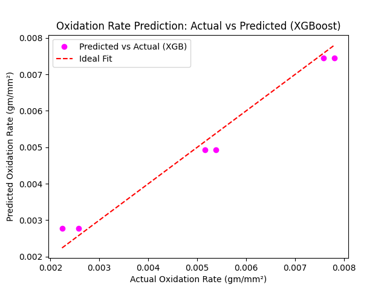
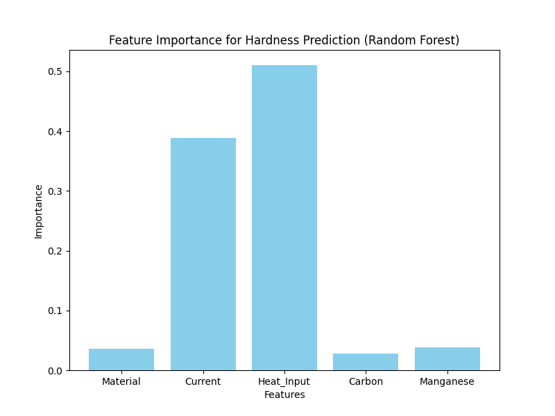
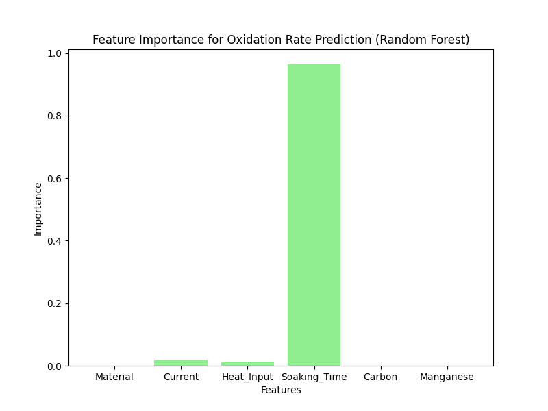

# Predicting Hardness and Oxidation Rates of Hardfaced Materials Using Machine Learning

## Overview
This project applies machine learning to predict the hardness and oxidation rates of hardfaced materials (EN-8 and mild steel) coated with Stellite-6 via TIG surfacing. The data is sourced from experimental results published in *"Experimental Studies of Stellite-6 Hardfaced Layer on Ferrous Materials by TIG Surfacing Process"* (IOP Conf. Ser.: Mater. Sci. Eng., 2020). Using Random Forest, Linear Regression, and XGBoost models, the project achieves R² scores of up to 1.00, demonstrating the potential of ML in material science applications.

A Flask web app allows users to input material properties and get predictions interactively. The app is deployed at [https://material-hardness-oxidation-prediction.onrender.com](https://material-hardness-oxidation-prediction.onrender.com).

## Project Goals
- Predict hardness and oxidation rates of hardfaced materials using machine learning models.
- Compare the performance of Random Forest, Linear Regression, and XGBoost algorithms.
- Identify key factors influencing material properties through feature importance analysis.
- Visualize predicted vs. actual values and feature importance for model evaluation.
- Deploy a web app for interactive predictions.

## Tech Stack
- **Programming Language**: Python 3.10.17
- **Libraries**:
  - `pandas`: Data manipulation and preprocessing.
  - `scikit-learn`: Random Forest Regressor, Linear Regression, train-test splitting, and evaluation metrics (MSE, R²).
  - `xgboost`: Gradient Boosting model for improved predictions.
  - `matplotlib`: Visualization of predicted vs. actual values and feature importance.
  - `numpy`: Numerical operations and data handling.
  - `flask`: Web app framework for deployment.
  - `joblib`: Saving and loading trained models.
  - `gunicorn`: WSGI server for deployment.
- **Development Environment**: Local machine with zsh shell (macOS/Linux).
- **Version Control**: Git and GitHub for repository management.
- **Deployment Platform**: Render (free tier).
- **Hardware**: Standard laptop (no GPU required).

## Methodology
1. **Data Collection**:
   - Sourced from experimental results in the referenced paper:
     - Welding currents: 120A, 125A, 130A, 135A, 140A, 145A, 150A, 155A, 160A (interpolated for 125A, 135A, etc.).
     - Heat input: 0.8–0.912 kJ/mm.
     - Material types: EN-8 and mild steel.
     - Soaking times: 5, 10, 15 hours (for oxidation rates).
     - Material composition: Carbon (EN-8: 0.37, Mild Steel: 0.23), Manganese (EN-8: 0.8, Mild Steel: 1.0).
   - Hardness dataset: 16 rows (expanded with interpolation).
   - Oxidation dataset: 30 rows (expanded with interpolation).

2. **Data Preprocessing**:
   - Encoded categorical variable `Material` (EN-8: 0, 'Mild Steel': 1).
   - Features used: Material, Current, Heat Input, Carbon, Manganese (plus Soaking Time for oxidation).
   - Split data into 80% training and 20% testing sets (`random_state=42` for reproducibility).

3. **Modeling**:
   - **Random Forest Regressor**: Tuned for hardness prediction to reduce overfitting (`n_estimators=50`, `max_depth=3`, `min_samples_split=4`, `min_samples_leaf=2`).
   - **Linear Regression**: Used for comparison, suitable for potentially linear relationships.
   - **XGBoost**: Added as a Gradient Boosting model to improve predictions.
   - Evaluated using Mean Squared Error (MSE) and R² score.

4. **Feature Importance**:
   - Analyzed using Random Forest’s feature importance and visualized as bar charts.

5. **Visualization**:
   - Created scatter plots of predicted vs. actual values for all models.
   - Generated bar charts for feature importance.

6. **Deployment**:
   - Built a Flask web app using the best models (Linear Regression for hardness, Random Forest for oxidation).
   - Deployed on Render for online access.

## Results
- **Hardness Prediction (Random Forest)**:
  - MSE: 56.33
  - R²: 0.71
  - 
- **Hardness Prediction (Linear Regression)**:
  - MSE: 3.19
  - R²: 0.98
  - 
- **Hardness Prediction (XGBoost)**:
  - MSE: 10.11
  - R²: 0.95
  - 
- **Oxidation Rate Prediction (Random Forest)**:
  - MSE: 0.000000
  - R²: 1.00
  - 
- **Oxidation Rate Prediction (Linear Regression)**:
  - MSE: 0.000000
  - R²: 0.99
  - 
- **Oxidation Rate Prediction (XGBoost)**:
  - MSE: 0.000000
  - R²: 0.97
  - 

## Feature Importance (Random Forest)
- **Hardness Prediction**:
  - Material: 0.0354
  - Current: 0.3886
  - Heat_Input: 0.5104
  - Carbon: 0.0275
  - Manganese: 0.0380
  - 
- **Oxidation Rate Prediction**:
  - Material: 0.0005
  - Current: 0.0207
  - Heat_Input: 0.0132
  - Soaking_Time: 0.9644
  - Carbon: 0.0006
  - Manganese: 0.0006
  - 

**Interpretation**:
- For hardness, Linear Regression performs best (R²: 0.98), followed by XGBoost (R²: 0.95) and Random Forest (R²: 0.71). The tuned Random Forest significantly improved from its previous performance, and `Heat_Input` (0.5104) and `Current` (0.3886) remain the most influential features, reflecting the impact of welding parameters.
- For oxidation rate, Random Forest achieves a perfect fit (R²: 1.00), with Linear Regression (R²: 0.99) and XGBoost (R²: 0.97) also performing exceptionally well. `Soaking_Time` (0.9644) dominates, consistent with experimental findings where longer soaking times significantly increase oxidation rates.

## Files
- `predict.py`: Python script to train and save the models.
- `app.py`: Flask web app for interactive predictions.
- `templates/index.html`: HTML form for user input.
- `templates/result.html`: HTML page to display prediction results.
- `lr_hardness_model.pkl`: Saved Linear Regression model for hardness prediction.
- `rf_oxidation_model.pkl`: Saved Random Forest model for oxidation rate prediction.
- `hardness_prediction_rf.png`: Scatter plot of predicted vs. actual hardness (Random Forest).
- `hardness_prediction_lr.png`: Scatter plot of predicted vs. actual hardness (Linear Regression).
- `hardness_prediction_xgb.png`: Scatter plot of predicted vs. actual hardness (XGBoost).
- `oxidation_prediction_rf.png`: Scatter plot of predicted vs. actual oxidation rates (Random Forest).
- `oxidation_prediction_lr.png`: Scatter plot of predicted vs. actual oxidation rates (Linear Regression).
- `oxidation_prediction_xgb.png`: Scatter plot of predicted vs. actual oxidation rates (XGBoost).
- `hardness_feature_importance.png`: Bar chart of feature importance for hardness (Random Forest).
- `oxidation_feature_importance.png`: Bar chart of feature importance for oxidation (Random Forest).

## How to Run Locally
1. **Prerequisites**:
   - Python 3.10.17
   - Install required libraries:
     ```
     pip install -r requirements.txt
     ```
2. **Clone the Repository**:
   ```
   git clone https://github.com/thesoulseizure/Material-Hardness-Oxidation-Prediction.git
   cd Material-Hardness-Oxidation-Prediction
   ```
3. **Train and Save Models**:
   ```
   python3 predict.py
   ```
   - Outputs `lr_hardness_model.pkl` and `rf_oxidation_model.pkl`.
4. **Run the Web App**:
   ```
   python3 app.py
   ```
   - Open `http://127.0.0.1:5001` in your browser to use the app.

## Access the Deployed App
- The web app is deployed at [https://material-hardness-oxidation-prediction.onrender.com](https://material-hardness-oxidation-prediction.onrender.com).
- Enter material properties to get predictions for hardness and oxidation rates.

## Future Improvements
- Collect additional experimental data to further expand the dataset.
- Implement cross-validation to ensure model robustness.
- Add input validation and error handling in the web app.
- Enhance the web app UI with visualizations of feature importance.

## Acknowledgments
- Data sourced from *"Experimental Studies of Stellite-6 Hardfaced Layer on Ferrous Materials by TIG Surfacing Process"* (IOP Conf. Ser.: Mater. Sci. Eng., 2020).
- Project updated and deployed on May 26, 2025.
